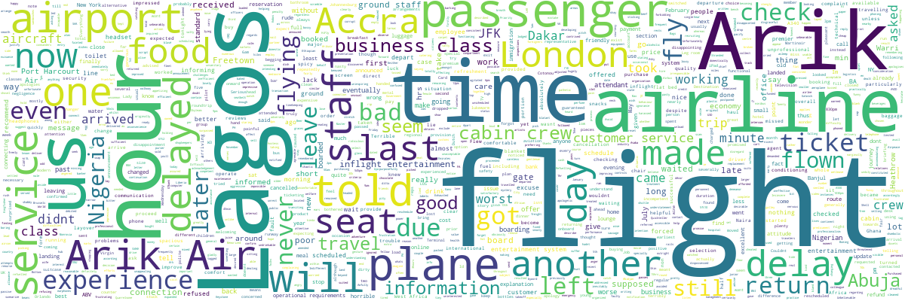

# Sentiment Analysis of Customer Reviews on Two Airlines: Qatar Airways and Arik Air
___
## Qatar Airways


Total number of reviews: **100**

___
Q1: How many reviews are from verified trips?


___
Q2: What are the most common words?


Common words include: flight, Qatar Airways, Doha (which is where the airport of their many flights occur), seat, good, service, food, excellent, comfortable, time, staff e.tc.
___
Q3: What is the distribution of Positive, Neutral, Negative Reviews?


69% of the reviews were seen as postive after sentiment analysis with about 23% being negative and 8% were neutral (in between), this shows that Qatar airways is a great airline to fly with as they have high positive reviews from their customers. Qatar Airways can study the negative and neutral reviews to know where areas of improvement should occur.
___
Q4: What are the most common words from the Positive Reviews?


Most Common Words from Positive Reviews Include:
good, staff, airline, friendly, excellent, experience, comfortable, meal, great, helpful, attentive, quality,  friendly, smooth

Indicating that experience was excellent, friendly staff,  good feeding services, great airline, attentive staff, comfortable flight, smooth flight, high quality airline among others.
___
Q5: What are the most common words from the Neutral Reviews?


Most Common Words from Neutral Reviews Include:
food, back, aircraft, first, changed, bus, gate, always, leg room, excellent

This shows the neutal reviews were slightly skewed more to the positive edge than the negative one.
___
Q6: What are the most common words from the Negative Reviews?


Most Common Words from Negative Reviews Include:
gate, customer, hours, good, bad, Qsuite, Doha airport, uncomfortable, DOH(airport), missed, chaotic

After  analysis, it was observed most of the negative reviews were about the operations of Doha airport rather than Qatar Airways itself. Reviews mostly talked about the "dreaded bus gate areas" and "chaotic bus transfers" that are unorgainzed, shortage of buses, frustrating with rude gate agents/
___
Q7: What is the most positive review

```
This is our second time flying with Qatar Airways. We flew LAX to DOH, stayed a few days and then onto CAI and back. From check in to in flight Qatar Airways makes it a truly wonderful experience. The check in at LAX was quick and friendly and don't even get me started on the experience of checking in at DOH; offered beverages, sit down and very attentive and friendly. The lounges are so relaxing, good food, drinks, the lounge at DOH has "hotel" rooms in it you can sleep in for a few hours. Service is top notch. Now for the flight. Warm greeting and welcome, Q Suites there are no words just comfortable, easy to sleep well in (I slept 10 hours). The amenity kit bags were colored for Breast Cancer awareness and the PJs for World Cup, awesome. The food was delicious as usual, flavorful, many choices, served at a good temperature and displayed nicely. They do have a new added light meal menu for world cup and it's like tailgate food; chips and guaq, potato ball, fish and chips, hamburger. I loved the idea, so fun and the execution was great. I hope they keep some of the items even after WC. World class experience that makes you look forward to flying for 16 hours! - Score of 99.6%
```
___
Q8: What is the most negative review

```
Flights and service were good as usual, with a high standard and service and catering. What is getting really bad is Doha airport. I departed from the dreaded bus gate area downstairs. It seems this becomes the norm now, since almost all my flights this year were bus transfers. It becomes more and more chaotic, but todays experience was really really bad. It was utter chaos with unorganized lines, frustrated and rude gate agents.  The shortage of buses added to the chaos. With this, Doha is miles away from becoming a world class airport. - Score of -98.6%
```
___
Q9: What is the Distribution of Sentiment Analysis Scores from Reviews


As we can see from the graph above, majority of the reviews were positive with the neutal reviews (orange) slanting more to the positive ones (blue) and the negative reviews are comparably low
___
## Arik Airways


Total number of reviews: **53**

___
Q1: What are the most common words?



Common words include: flight, Arik, Arik Air, Lagos (which is where the airport of their many flights occur), passengers, staff, delay, experience, last time e.tc.

We're already seeing some negative words in the most common.
___
Q2: What is the distribution of Positive, Neutral, Negative Reviews?


Wow, 64% of the reviews were negative thats a lot with only 32% were positive!. Arik Air needs a lot of improvement if they want to satisfy their customers. they can study the reviews to see where rooms of improvements may occur.
___
Q3: What are the most common words from the Positive Reviews?


Most Common Words from Positive Reviews Include:
food, good, cabin crew, inflight entertainment, flights, seat, staff.

Indicating that maybe customers enjoy the food, seat, cabin-crew and inflight entertainment.
___
Q4: What are the most common words from the Neutral Reviews?


Most Common Words from Neutral Reviews Include:
class, short, booking, premier, Accra, offered, minutes, sausage.

It seems most neutral deals with the class of the flight, food offered and minutes spent or delayed or flights from/to Accra
___
Q5: What are the most common words from the Negative Reviews?


The negative reviews are more filled than the positive and neutral ones.

Most Common Words from Negative Reviews Include:
airline, passengers, Port Harcourt, plane, hours, delayed, Accra, bad, experience, last, check, operational requirements, business class etc.

These are a lot of negative words, it seems most of them are criticizing the business class
___
Q7: What is the most positive review

```
I have just returned from a trip to Lagos Nigeria in Economy Class from Heathrow. I can not fault the aeroplane there was lots of leg room (and my partner and I are not short at 5ft10 and 6ft2) good entertainment selection and plenty of food and drink throughout the journey. All the staff were welcoming and the plane was clean. My only complaint would be that both food options on the way out were spicy Nigerian dishes (but this is only because I am fussy if you like spicy food you will love the selection) however on the way back there was a non spicy dish which was lovely. I would not hesitate to fly with Arik again. - Score of 97%
```
___
Q8: What is the most negative review

```
Without any doubt the worst business class in Africa. Everything was wrong. Even with a most expensive business class ticket, I was requested to be at the very small and terribly mediocre Freetown airport 2 hours ahead of the flight: when one knows how few flights there are per day, ridiculous. When I checked in I was guaranteed that the flight had taken off from Accra where it came from and was due on time in Freetown, when I checked later with the crew, I found out it was a total lie as the flight was delayed and it was still on the ground at that time. When I checked in, I also asked about the business lounge and was told that of course I could use it, but after immigration I discovered it had been closed and remained closed for the 3 hours I waited: one of the shopkeepers nearby told me that the staff looking after the lounge had left because "they had other things to do". So I had to wait on the most uncomfortable metal bench with no air conditioning for 3 hours, nothing else was available. We received no information about the delay and no Arik Air staff were visible after the check-in counter. At 1am, the boarding was done in a most unprofessional way even for this continent where I have been some 3 or 400 times. Exhausted, I'm not very young to say the least, by this horrible experience on the ground I thought I would have 1.5 agreeable hours specially being the only passenger in business class. This was wrong, very wrong. I was first requested to stop using my iPad as Arik seems to be the only airline (with SAA) forbidding the use of an iPad during takeoff and landing. I asked for a glass of wine and was offered a choice between 2 tiny plastic bottles of lukewarm undrinkable wines. Beer was also lukewarm. The dinner consisted of 2 sandwiches, worse than what a low cost airline would offer. The crew was about as nice as their fellow citizens the immigration officers at Lagos airport. Horrible experience at a cost of nearly 700 USD one way for 900 miles. A rip-off would be an understatement. - Score of -99.5%
```
___
Q9: What is the Distribution of Sentiment Analysis Scores from Reviews


As we can see from the graph above, majority of the reviews were negative and few were positive, the neutral reviews seemed slanted to the positive side
